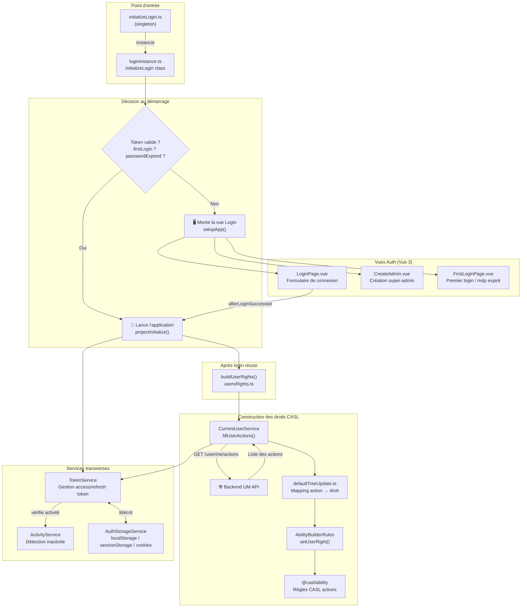
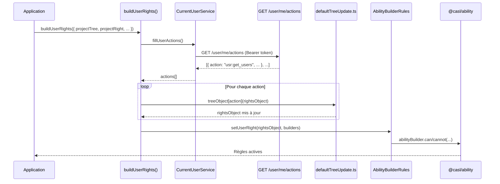
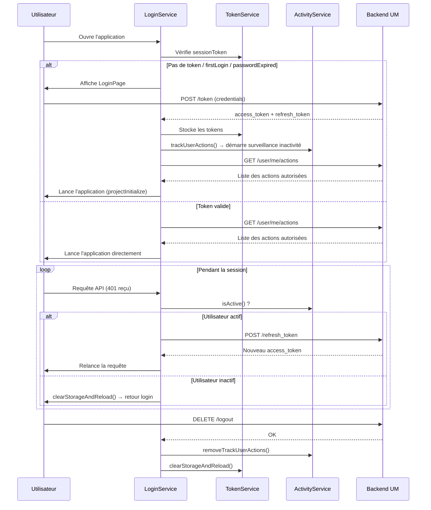

# Login-Service — Architecture & Services

> Documentation des services fournis par le `login-service` du frontend User Management.

---

## Vue d'ensemble

Le `login-service` est une librairie frontend partagée qui gère :
- Le **cycle de vie de la session** (login, logout, refresh token)
- La **détection d'inactivité** utilisateur
- La **gestion du stockage** des tokens et données utilisateur
- La **construction des droits CASL** à partir des actions backend

---

## Schéma général des services



---

## Détail des services

### 1. `InitializeLogin` — Point d'entrée
**Fichier :** `src/auth/loginInstance.ts`

Classe principale orchestrant le démarrage de l'application.

| Méthode | Rôle |
|---|---|
| `start(options)` | Lance le cycle de démarrage |
| `createView(options)` | Décide si on monte la vue Login ou l'app directe |
| `setupApp(options)` | Monte la vue Login (Vue + Router + Pinia + i18n) |
| `unmount()` | Démonte la vue Login après connexion |
| `afterLoginSuccessed()` | Callback post-login → redirige et lance `projectInitialize()` |
| `defaultRedirectPath()` | Calcule l'URL de redirection post-login (lastVisitedUrl / favoriteApp / basePath) |

**Logique de démarrage :**
```
sessionToken présent ET pas firstLogin ET pas passwordExpired
    → projectInitialize()  (application directe)
sinon
    → mount LoginPage
```

---

### 2. `TokenService` — Gestion des tokens
**Fichier :** `src/services/TokenService.ts`

Gère le cycle de vie des access/refresh tokens et les intercepteurs HTTP.

| Méthode / Propriété | Rôle |
|---|---|
| `sessionToken` (get/set) | Lit/écrit le Bearer token dans le storage |
| `refreshToken` (get/set) | Lit/écrit le refresh token dans le storage |
| `refreshTokenOrClearStorage()` | Tente un refresh token ; si inactif → déconnexion |
| `#initiateTokenRefresh()` | `POST /refresh_token` → met à jour les tokens |
| `clearStorageAndReload()` | Nettoie le storage et redirige vers login |
| `handleResponseInterceptor` | Intercepteur Fetch : 401 → refresh, 403 → notif |
| `tokenErrorInterceptorsBuilder` | Intercepteur Axios : 401 → refresh, 403 → notif |
| `errorTokenCallback` | Relance la requête échouée après refresh |
| `clientTokenErrorInterceptor` (static) | Intercepteur prêt à l'emploi pour les clients Axios |

---

### 3. `ActivityService` — Détection d'inactivité
**Fichier :** `src/services/ActivityService.ts`

Surveille l'activité souris/clavier pour déclencher une déconnexion automatique.

| Méthode | Rôle |
|---|---|
| `trackUserActions(options)` | Attache les listeners sur `mousemove`, `scroll`, `keydown`, `resize` |
| `resetUserActivity()` | Remet le timer à zéro lors d'une action utilisateur |
| `inactiveUser()` | Marque l'utilisateur comme inactif et déclenche `timeoutAction` |
| `isActive()` | Retourne `true` si l'utilisateur est actif |
| `removeTrackUserActions()` | Retire les listeners (à la déconnexion) |

**Configuration par défaut :**
```
Seuil d'inactivité : 3 600 000 ms (1 heure)
Debounce             : 1 000 ms
Événements suivis   : mousemove, scroll, keydown, resize
```

---

### 4. `CurrentUserService` — Données utilisateur courant
**Fichier :** `src/services/CurrentUserService.ts`

Gère les informations de l'utilisateur connecté et ses actions autorisées.

| Méthode | Rôle |
|---|---|
| `setUser(user)` | Persiste les données utilisateur dans le storage + événement custom DOM |
| `fillUserActions()` | `GET /user/me/actions` → stocke les actions autorisées |
| `setCurrentUserActions(actions)` | Setter des actions (propriété statique) |
| `getCurrentUserActions()` | Getter des actions |
| `getUserId()` | Récupère l'ID utilisateur depuis le storage |
| `getUsername()` | Récupère le nom d'utilisateur |
| `getUserIdpName()` | Récupère le nom de l'IDP |
| `isFirstLogin()` | Vérifie si c'est le premier login |
| `isPasswordExpired()` | Vérifie si le mot de passe est expiré |
| `getIsAdmin()` | Vérifie si l'utilisateur est admin |

---

### 5. `AuthStorageService` — Gestion du stockage
**Fichier :** `src/services/AuthStorageService.ts`

Abstraction sur les storages du navigateur avec support du préfixe `APP_ID`.

| Méthode | Stockage cible | Rôle |
|---|---|---|
| `addToLocalStorage(key, value)` | localStorage | Stockage avec préfixe `APP_ID:key` |
| `getFromLocalStorage(key)` | localStorage | Lecture avec préfixe |
| `removeFromLocalStorage(key)` | localStorage | Suppression avec préfixe |
| `saveAuthToStorages(key, value)` | localStorage + sessionStorage + cookies | Tokens auth (triple stockage) |
| `addToStorages(key, value)` | localStorage + sessionStorage | Données utilisateur |
| `writeAuthDataInSessionStorage()` | sessionStorage | Rétro-compatibilité auth data |
| `writeUserDataInSessionStorage()` | sessionStorage | Rétro-compatibilité user data |
| `addToCookies(key, value, days?)` | cookies | Durée 7j par défaut, path = `/<releaseName>` |
| `getFromCookies(key)` | cookies | Lecture cookie |
| `deleteCookies(names)` | cookies | Suppression multi-path |
| `clearAuthAndUserDataFromStorages()` | Tous | Nettoyage complet à la déconnexion |

**Données AUTH stockées :** `sessionToken`, `refreshToken`, `currentUserName`

**Données USER stockées :** `currentUserName`, `currentUserId`, `currentUserIdpName`, `isTokenActive`, `firstLogin`, `isAdmin`, `preferences`

---

### 6. `buildUserRights` + `AbilityBuilderRules` — Droits CASL
**Fichiers :** `src/services/abilities/usersRights.ts`, `src/services/abilities/AbilityBuilderRules.ts`

Construit les règles de droits CASL à partir des actions retournées par le backend.

#### Flux de construction



#### Niveaux de droits

| Niveau | Valeur | Description |
|---|---|---|
| `hidden` | Caché | Pas de droit (défaut) |
| `view` | Lecture seule | Peut voir l'élément |
| `edit` | Modification | Peut modifier l'élément |
| `use` | Utilisation | Peut utiliser la fonctionnalité |
| `unset` | Non défini | Affiché mais non configuré |

#### Mapping action → droit (exemples)

| Action Backend | Constante CASL | Niveau |
|---|---|---|
| `usr:get_users` | `API.GET_USERS` | `VIEW` |
| `usr:update_configuration` | `API.UPDATE_CONFIGURATION` | `EDIT` |
| `usr:logout` | `logout` | `EDIT` |
| `usr:change_password` | `changePassword` | `EDIT` |
| `usr:refresh_token` | `API.REFRESH_TOKEN` | `VIEW` |

---

## Cycle de vie complet d'une session



---

## Intégration dans une application produit

```typescript
// main.ts d'une application
import initializeLogin from '@ateme/login-service/src/auth/initializeLogin'
import { getSingletonBuilder } from '@ateme/login-service/src/services/abilities/AbilityBuilderRules'

initializeLogin.start({
  app: ApplicationService.getApp()!,
  productLoginLogo: '',
  langLocale: 'en-US',
  optionsLogin: { defaultAdminLevel: null },
  projectName: 'Mon Application',
  projectInitialize: async () => {
    // Monter l'app Vue principale
    // Les droits CASL sont déjà construits via buildUserRights()
    const rules = getSingletonBuilder().getRules()
    app.use(abilitiesPlugin, new Ability(rules))
  }
})
```

**Paramètres de `start()`:**

| Paramètre | Type | Requis | Description |
|---|---|---|---|
| `app` | `App` (Vue) | ✅ | Instance Vue de l'application |
| `projectName` | `string` | ✅ | Nom affiché sur la page login |
| `productLoginLogo` | `string` | ✅ | URL du logo sur la page login |
| `projectInitialize` | `Function` | ✅ | Callback de démarrage de l'app |
| `optionsLogin` | `RouterOptions` | ✅ | Options router (`defaultAdminLevel`) |
| `langLocale` | `string` | ❌ | Locale i18n (défaut: `en-US`) |
| `useLegacyI18N` | `boolean` | ❌ | Mode i18n legacy |

